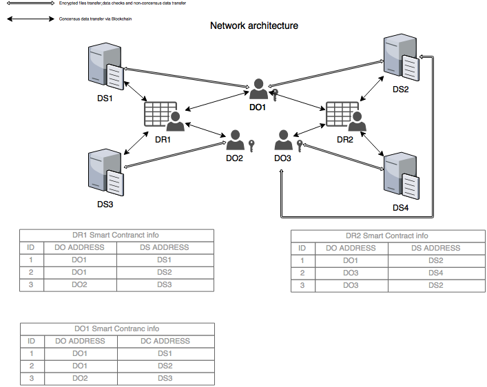

##File Storage Marketplace 

Main purpose of the system is to provide decentralized and secure disk space trading platform. The principle is free market between Data Owners (DO) who need disk space to store their files securely and Disk Space Owners (DSO) who rents their free disk space.  
Main system advantage comparing to centralized file storages like Dropbox or Google drive is Blockchain based data routing and payments. That means that there is no central authority who can block or access your data. Smart Contracts, which keep cryptocurrency and make payments, are supported by decentralized Ethereum Blockchain network. So, there are no centralized intermediaries who keep money and play a role of escrow.   
All the parts of software are open-source. DO’s data can be decrypted by his private key securely stored in his environment only. 

###User interface drafts 
Need to figure out. Can be based on Excel. 
###Trading screen 
DO contracts screen 
DSO contracts screen 
DC contracts screen 
###Network architecture 

###Process flow diagram 
Insert diagram. Consider modifying it for intermediate as well. 
##FAQ
